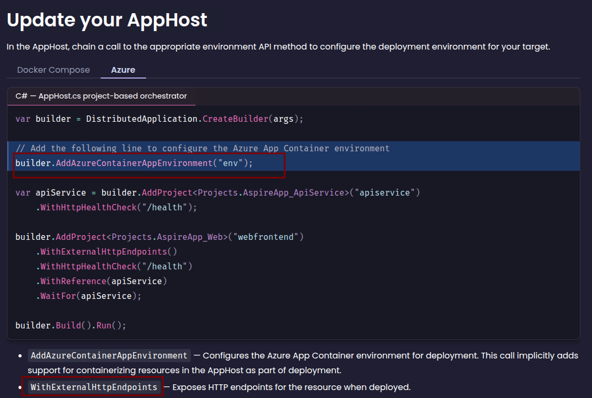

# Hello Aspire

[Aspire](https://aspire.dev/) is a full-stack orchestration toolkit to simplify distributed app creation and maintenance.

I've installed the pre-reqs and I'm following the [build your first app](https://aspire.dev/get-started/first-app/?lang=csharp) guide.

## Configuration

[Deploy your first app](https://aspire.dev/get-started/deploy-first-app/?lang=csharp#prerequisites) requires Docker, Podman, or Azure CLI. I chose Azure CLI.

## Feedback

Most important feedback at the top

- `aspire new` should include `.gitignore`
- Would be great to have CLI options baked-in to first `aspire new` run instead of clicking through GUI to create test project, etc.
- [Deploy your first Aspire app](https://aspire.dev/get-started/deploy-first-app/?lang=csharp#add-deployment-package) references `WithExternalHttpEndpoints` but that isn't configured in the diff
- Why did `.aspire/settings.json` appear after `aspire run`? Should I commit it?
- Output log on `aspire new` not so good
- Site should clarify pre-reqs clearer?
- `slnx` support would be great

External HTTP endpoints not used

