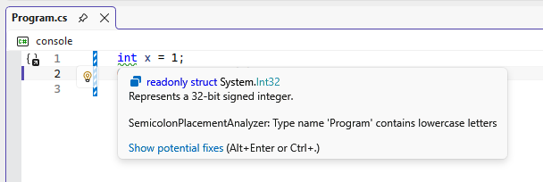

# Semicolon Placement Analyzer (SCPA)

The [.NET Compiler Platform SDK](https://learn.microsoft.com/en-us/dotnet/csharp/roslyn-sdk/), AKA Roslyn, allows developers to create custom "analyzers" that run when code is built or formatted. This is effectively a nice plugin system for exposing compiler information, and this is a sample project to build a single Roslyn analyzer. The goal of this analyzer is to better format weirdly-placed semicolons, for example:

```cs
Console.WriteLine("")

;
```

After formatting according to this analyzer, the goal is to return:

```cs
Console.WriteLine("");
```

From what I can tell, this analyzer isn't available in .NET by default. I'm no expert!

## Getting started

[Tutorial: Write your first analyzer and code fix](https://learn.microsoft.com/en-us/dotnet/csharp/roslyn-sdk/tutorials/how-to-write-csharp-analyzer-code-fix)

1. Open Visual Studio 2026 (yes this requires Visual Studio)
1. Create a new project with the "Analyzer with Code Fix (C#)" template
1. Place project and solution in the same folder
1. Use .NET Framework 4.8

The project should be created. You can then open the solution in Visual Studio and run it:

1. Startup Project/Profile: Vsix
1. `F5` to run the project, which opens a new instance of Visual Studio
1. Open (or create) a minimal console app (framework doesn't matter, but minimal apps are easier)
1. Modify Program.cs:
   ```cs
   int x = 1;
   Console.WriteLine(x);
   ```

You should see a complaint that lowercase letters are present:



The guide says that there is also a fix provided, but I'm not seeing that at this point.

Note that this project doesn't work with `dotnet run` or other .NET CLI commands out of the box. This is apparently due to compatibility issues with modern versions of MSBuild, not very interesting.
