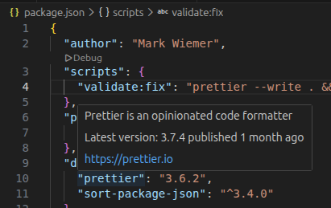

# Visual Studio Code

Commonly known as VS Code, this is the most popular IDE in the world!

## Troubleshooting

General steps for solving new issues

- Extension bisect: "Help: Start Extension Bisect"
- Settings: the `@modified` tag can help narrow down the issue
- [New profile](https://code.visualstudio.com/docs/configure/profiles): try to reproduce the issue in a new VS Code profile

## Common issues

Exact steps for fixing issues I've had before

### package.json "dependencies" versions not appearing on hover

Expected behavior: When hovering over a dependency key in a package.json file, VS Code provides a hover, like it does here for me in a vanilla installation of VS Code:

However, this just isn't working for me despite a lot of troubleshooting!

- Extension bisect: even after disabling all installed extensions, the issue repeats.
- Settings: working on it...
- New profile: cannot reproduce in new profile!
